

# LIVRIUM • Estante Virtual & Ex Libris

> *Seu santuário literário pessoal para registrar leituras, acompanhar o progresso página a página e cultivar desafios enriquecedores.*

---

## 📖 Sobre o Projeto

O **Livrium** é uma aplicação web focada em organização de leituras e retenção de hábitos literários. Diferente dos organizadores tradicionais, ele combina usabilidade moderna com a atmosfera aconchegante e nostálgica de bibliotecas clássicas (*Nostalgic Library*).

O ecossistema reúne controle visual de acervo em prateleiras, acompanhamento de progresso diário, metas anuais, desafios gamificados e um diário exclusivo para catalogação de memórias e citações.

---

## 🎨 Identidade Visual (Paleta Nostalgic Library)

- **Borgonha Nobre:** `#4A1521` / `#3B1019`
- **Dourado Envelhecido:** `#C89D54` / `#E6CA85`
- **Mogno Profundo:** `#231A1C` / `#2A0B12`
- **Creme Pergaminho:** `#F7F2E7` / `#EDE5D3`

---

## 📸 Galeria de Telas da Aplicação

### 🚪 Portal de Entrada & Configurações
| Tela de Entrada (Boas-vindas) | Painel de Preferências & Perfil |
| :---: | :---: |
| 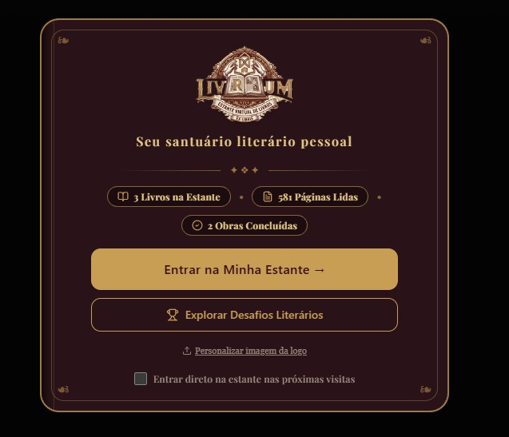 | 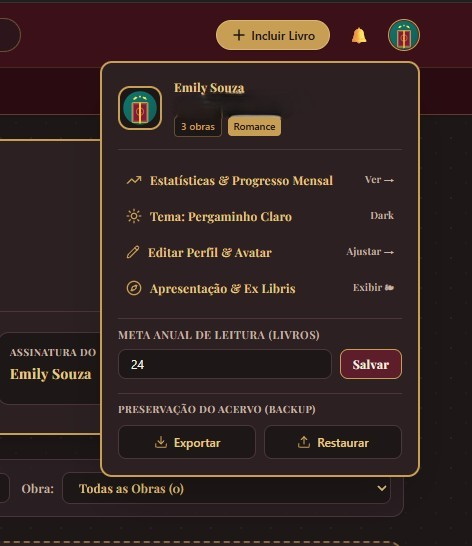 |

---

### 📚 Visão Geral do Santuário (Dashboard)
| Metas & Leitura Ativa | Progresso & Marcador Rápido |
| :---: | :---: |
| 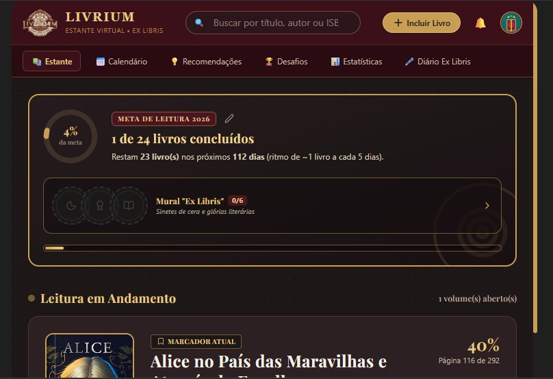 | 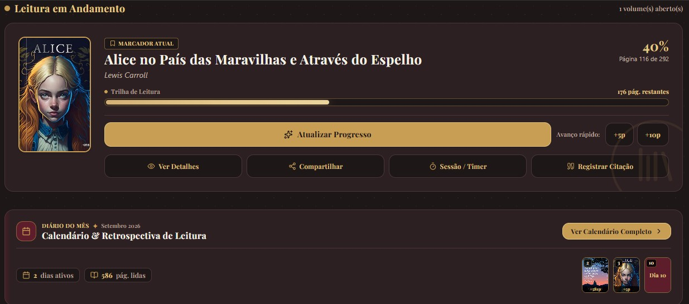 |

| Resumo do Acervo & Desafio em Foco | Estante Completa com Obras |
| :---: | :---: |
| 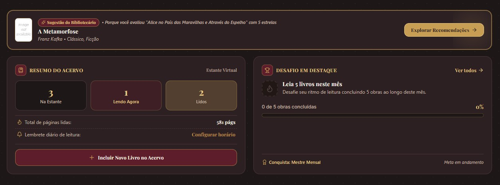 | 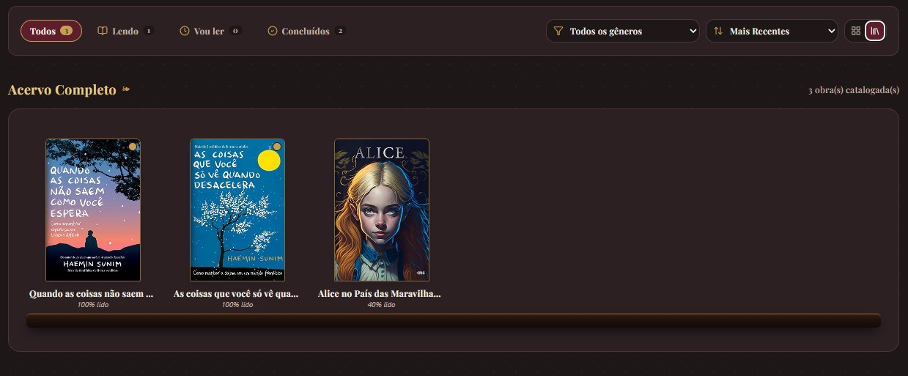 |

---

### 📅 Calendário Literário (Desktop & Mobile)
| Grade Mensal Desktop com Capas | Versão Responsiva Mobile |
| :---: | :---: |
| 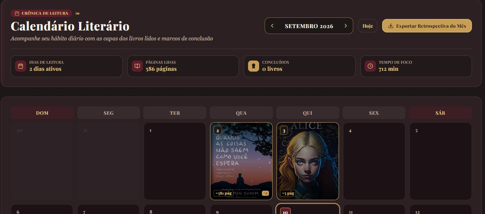 | 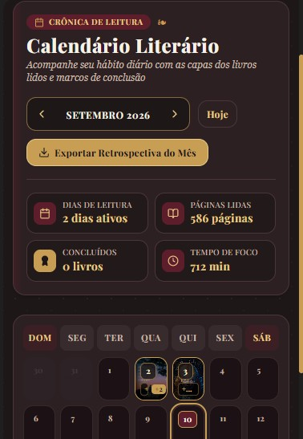 |

---

### 📊 Estatísticas & Análise Literária
| Indicadores Gerais & Metas | Gráfico Mensal & Distribuição de Gêneros |
| :---: | :---: |
| 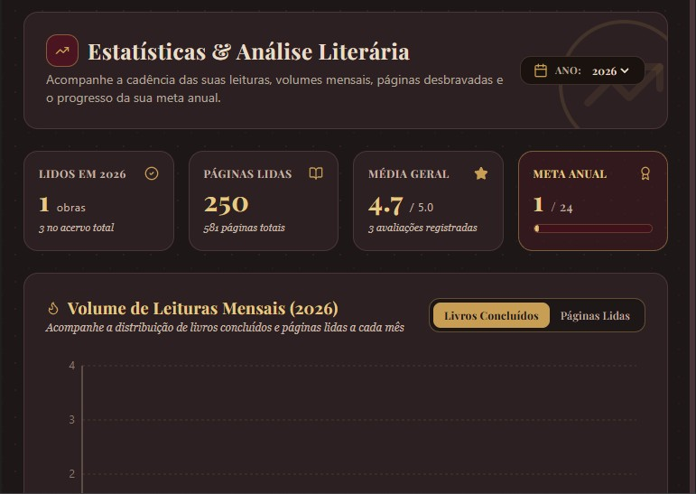 | 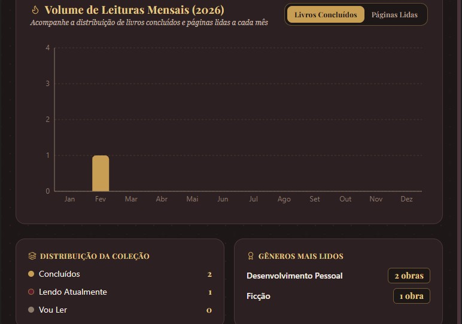 |

---

### 🖋️ Diário Literário & Ex Libris
| Mural do Grimório Literário | Área de Registro de Citações |
| :---: | :---: |
| 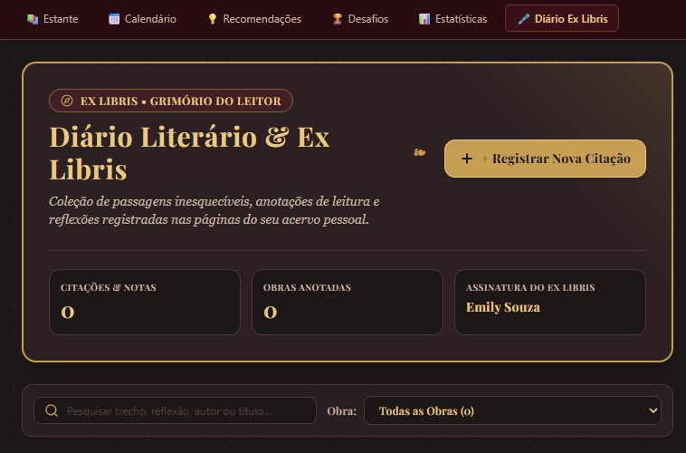 | 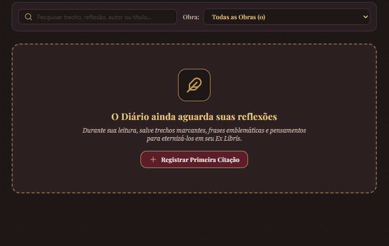 |

---

### 📖 Cadastro de Obras & Suporte a Formatos
| Entrada Manual com Status | Busca Automatizada por Título / ISBN |
| :---: | :---: |
| 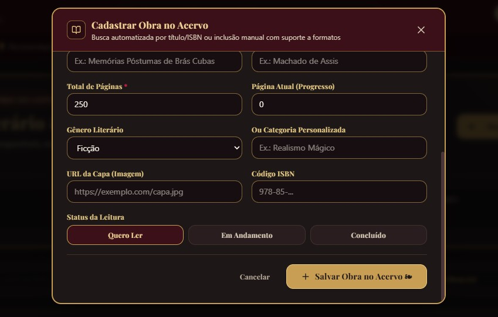 | 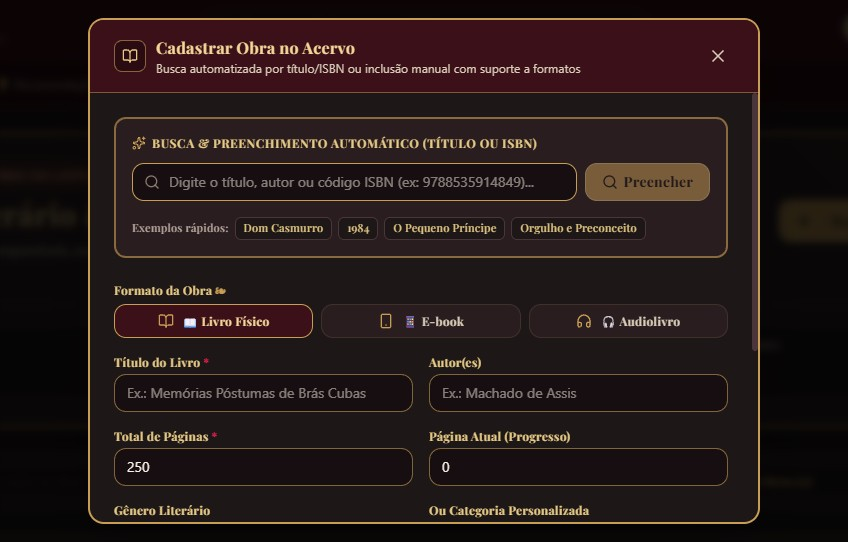 |

---

### 🏆 Desafios Literários & Recomendações
| Desafios & Conquistas de Leitura | Sugestões com Base no Histórico |
| :---: | :---: |
| 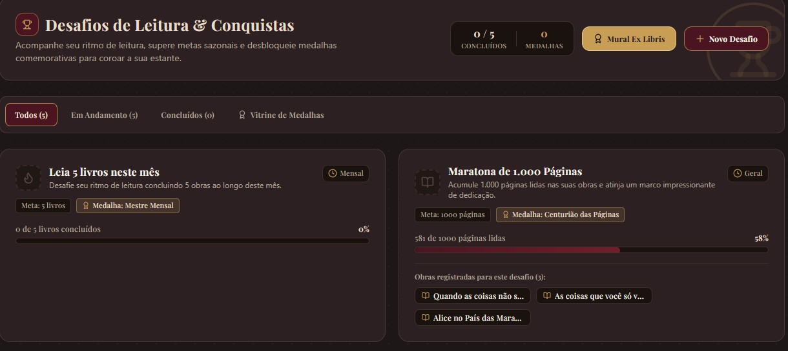 |  |

---

## 🛠️ Tecnologias Utilizadas

- **React.js** (Gerenciamento de estado e interface reativa)
- **Tailwind CSS** (Estilização modular e paleta customizada)
- **Design Responsivo** (Layout desktop com barra dupla e bottom navigation mobile)
- **Prototipagem & Engenharia de Prompt:** Google AI Studio

---

## 📄 Licença

Distribuído sob a licença MIT.
